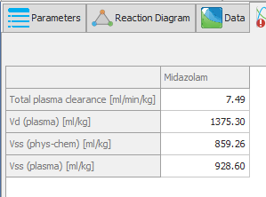
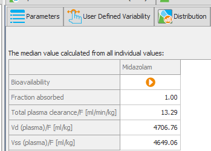
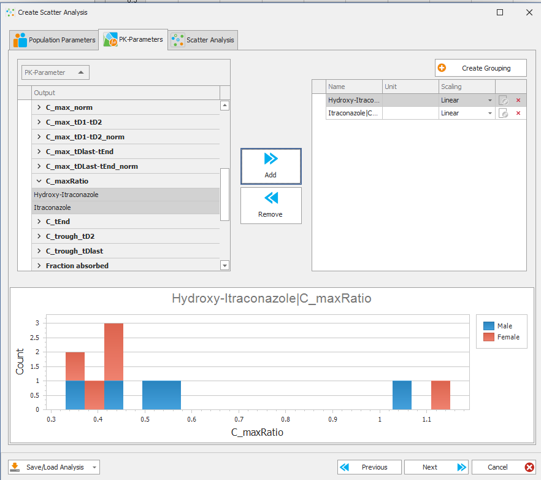
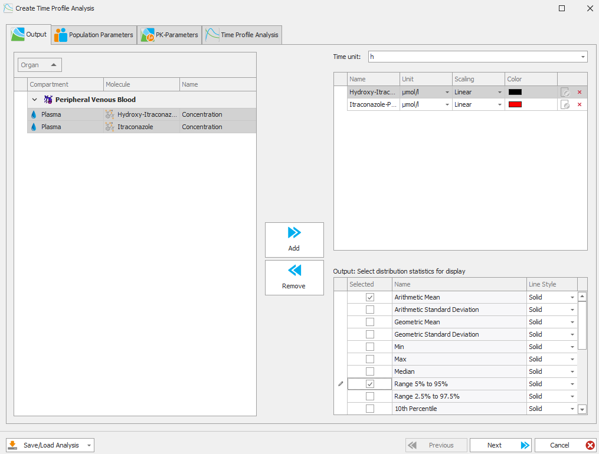
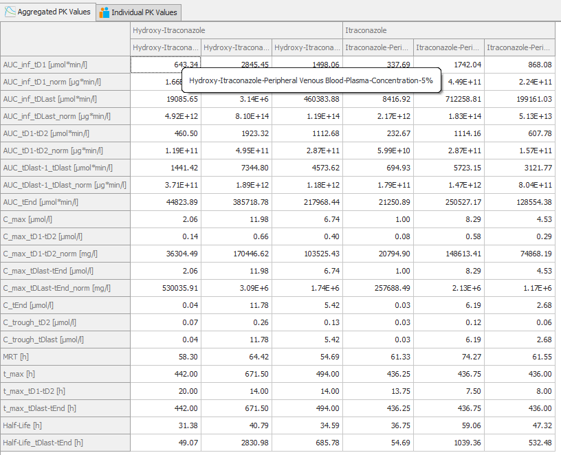
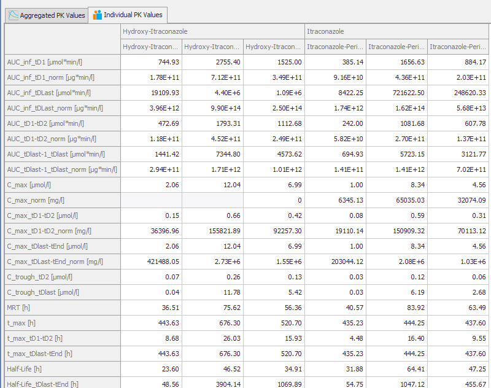

# Downloads:

- [Full setup **TODO**](TODO)

- [**ospsuite** R package **TODO**](TODO)

- [Gene expression database (human)](https://github.com/Open-Systems-Pharmacology/Gene-Expression-Databases/releases/download/v2.0.0/GENEDB_human.expressionDb)

# Release Notes for the Open Systems Pharmacology Software Suite 11 Update 1

## New features

### PK-Parameters in Population Simulations

Before version v11 Update 1 global pk parameters were only calculated for the selected outputs and were calculated based on the analyzed curve. For example, a mean curve was created and PK Values calculated once from that curve.

With the new release, population simulations contain new features for PK-analyses.

#### Global PK Analysis

Individual simulations prior to v11 update 1 have had a 'global' PK calculation done using venous blood curve.

This type of analysis was not prevsiously available for population simulations. The global pk parameters for population simulation will show in a similar location to the individual simulation, with the caption indicating how the values are aggregated. They are calculated for all individuals in the population and the displayed value is the median of the population values.

These newly availabe PK-parameters can also be used in the creation of other types of analysis. For example scatter analysis or box plot.

#### PK-parameters for range selections

Now when you select a range analysis for your time profile (eg. 5%-95%), Pk-parameters will be calculated for the upper and lower range.

Selecting Mean, and Range 5% to 95% as an example:

Generates PK-parameters for Mean, 5%, and 95% for each compound.

#### PK-Parameter Aggregation 
Also apparent from the screenshot is that there are tabs which display Pk-Parameters aggregated in different ways.

In the tab shown above, the tab 'Aggregated PK Values' is calculated from the analyzed curve. For example, the curve at the lower limit of the range 5% is used to calculate PK parameters.

Compared to the tab shown below, 'Individual PK Values' where PK Values are calculated for the individuals and then the median is shown.

### OSP Platform qualification library and PBPK Models Library
#### PBPK Models library extended
New PBPK models added:
* Felodipine
* Sildenafil

Model building process and model quality of every new PBPK model is documented in the corresponding _model evaluation report_. 
#### New releases of OSP Platform qualification library and PBPK Models Library
**TODO**
As with every new OSP Suite release, ALL platform qualification reports and model evaluation reports have been recreated with the new version of the OSP Suite and the latest version of the [_OSP Qualification Framework_](https://github.com/Open-Systems-Pharmacology/QualificationPlan/releases/latest):
* [**_OSP Qualification Reports library_**](https://github.com/Open-Systems-Pharmacology/OSP-Qualification-Reports) 
* [**_OSP-PBPK-Model-Library_**](https://github.com/Open-Systems-Pharmacology/OSP-PBPK-Model-Library)

### New release of the **ospsuite** R package

* ...

### (Re-)Qualification framework updated
OSP (Re-)Qualification framework is a technical framework to assess the confidence of specific intended use of the OSP platform. This framework allows for an automatic (re)-qualification workflow of the OSP suite. New release of the OSP (Re-)Qualification framework provides some improvements and bugfixes (s. below).

* (Re-)Qualification framework is not part of the OSP Suite setup (is only required for the creation of qualification reports) and must be installed separately. The latest release can be found [here](https://github.com/Open-Systems-Pharmacology/QualificationPlan/releases/latest)
* Full documentation of the (Re-)Qualification framework can be found [here](https://docs.open-systems-pharmacology.org/shared-tools-and-example-workflows/qualification)

## Fixed issues and Improvements

### PK-Sim
* [...](https://github.com/Open-Systems-Pharmacology/...)
* ...

### MoBi
* [...](https://github.com/Open-Systems-Pharmacology/...)
* ...

### PK-Sim and MoBi
* [...](https://github.com/Open-Systems-Pharmacology/...)
* ...

## Notes 
* ...
